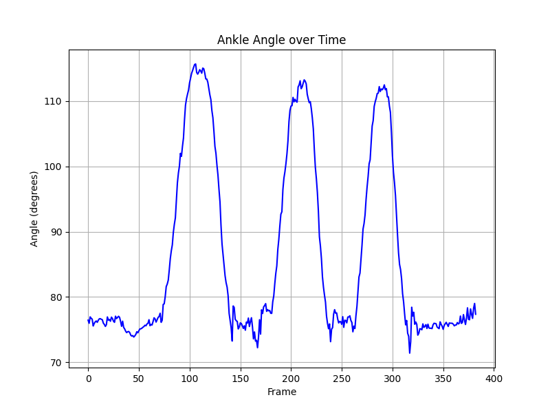
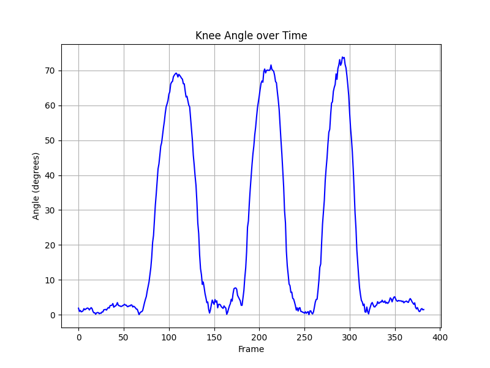
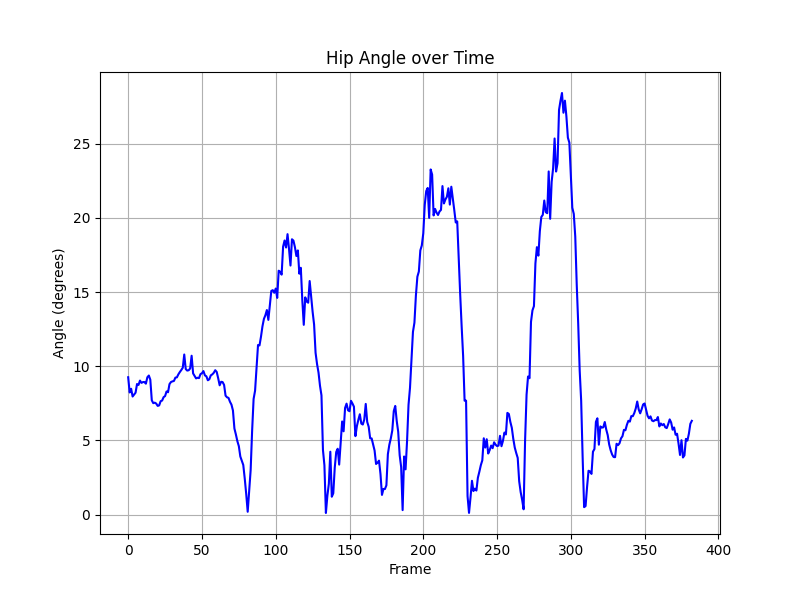

# YBTestJointEstimation 🦴📐

**YBTestJointEstimation** est un projet d'analyse biomécanique en Python conçu pour évaluer et estimer les angles articulaires du membre inférieur (cheville, genou, hanche) lors de la réalisation du **Y-Balance Test** (YBT).  Il permet d'estimer et de visualiser automatiquement les angles et amplitudes articulaires à partir de vidéos ou de séries d'images en utilisant des modèles de détection de pose (ex. MediaPipe / OpenPose / YOLO-Pose).

---
---

## 📌 Présentation du projet

Le Y-Balance Test est un test dynamique d'équilibre et de contrôle moteur utilisé en kinésithérapie et dans le sport. Ce dépôt permet :
1. De traiter des enregistrements / vidéos pour estimer la cinématique articulaire lors des mouvements d'extension et de stabilisation.
2. De calculer dynamiquement les angles des articulations clés du membre inférieur : **Cheville** (Ankle), **Genou** (Knee) et **Hanche** (Hip).
3. De générer des graphiques d'évolution angulaire au cours du temps.

---

## 📊 Graphiques et Visualisations

Le projet génère automatiquement trois graphiques décrivant la cinématique des articulations du membre inférieur au cours du test :

### 1. Angle de la cheville (`ankle_angle.png`)
Suivi de l'amplitude angulaire et de la mobilité au niveau de la cheville pendant le test.



---

### 2. Angle du genou (`knee_angle.png`)
Variation de la flexion/extension du genou lors de la phase de flexion sur la jambe d'appui.



---

### 3. Angle de la hanche (`hip_angle.png`)
Évolution de l'angle de flexion/extension de la hanche.



---

## 📂 Structure du dépôt

```text
YBTestJointEstimation/
├── main.ipynb                # Notebook Jupyter principal contenant le code d'estimation et de traitement
├── output_angles.xlsx        # Données d'angles brutes extraites par un modèles de détection de pose
├── output_displacement.xlsx  # Données de mouvements brutes extraites par un modèles de détection de pose
├── ankle_angle.png           # Graphique de l'angle de la cheville
├── knee_angle.png            # Graphique de l'angle du genou
├── hip_angle.png             # Graphique de l'angle de la hanche
└── README.md                 # Explication du projet
